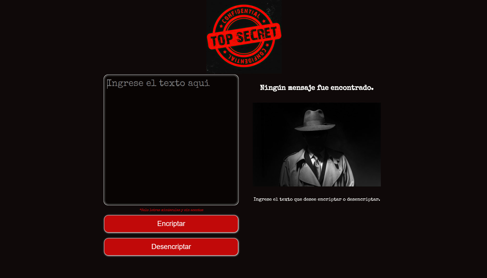

# Encriptador de texto 

Proyecto desarrollado en el marco del programa Oracle Next Education utilizando HTML5, CSS3 y JavaScript.

### Consignas

- Las llaves de encriptación deben ser las siguientes:

> e :tw-2194:  enter
> i  :tw-2194: imes
> a :tw-2194: ai
> o :tw-2194: ober
> u :tw-2194: ufat

- Debe funcionar solo con letras minúsculas.

- No deben ser utilizados letras con acentos ni caracteres especiales.

- Debe ser posible convertir una palabra para la versión encriptada también devolver una palabra encriptada para su versión original.

- La página debe tener campos para inserción del texto que será encriptado o desencriptado, y el usuario debe poder escoger entre as dos opciones.

- El resultado debe ser mostrado en la pantalla.

- Agregar un botón que copie el texto encriptado/desencriptado para la sección de transferencia, o sea que tenga la misma funcionalidad del ctrl+C o de la opción "copiar" del menú de las aplicaciones.

### Mensaje secreto

vobery ai flobertair cobermober mairimespobersai y pimescair cobermober aibenterjai